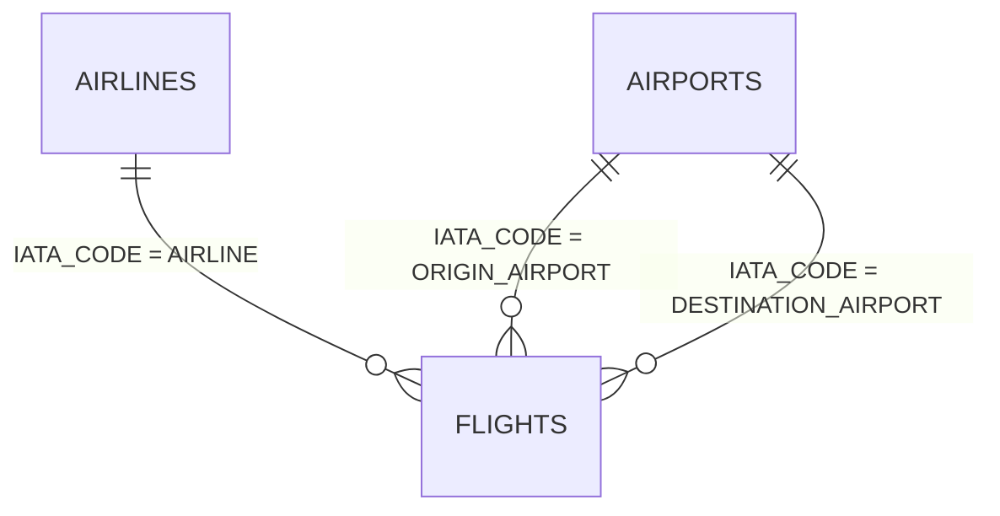

# Flight Operations Dashboard

An interactive Power BI dashboard for analysing U.S. flight operations, including flight volume, cancellations, airport activity, route performance, and delays.

## Files

- `Flight_Operations_Dashboard.pbix` — the Power BI dashboard.
- `RUN_ALL_POWERBI_VIEWS.sql` — MySQL views that prepare the data used by the dashboard.

## Dataset

Source: [2015 Flight Delays and Cancellations — U.S. Department of Transportation via Kaggle](https://www.kaggle.com/datasets/usdot/flight-delays).

The raw dataset is not included because of its size. Download it from Kaggle, load the `airlines`, `airports`, and `flights` tables into MySQL, then run `RUN_ALL_POWERBI_VIEWS.sql` before refreshing the Power BI report.
## Database schema

The project uses a star-schema design: `flights` is the fact table and `airlines` and `airports` are lookup tables.



### Source tables

| Table | Key | Purpose |
|---|---|---|
| `airlines` | `IATA_CODE` | Airline lookup table. |
| `airports` | `IATA_CODE` | Airport and location lookup table. |
| `flights` | Source does not provide a guaranteed single ID | Flight-level fact table. |

### Relationships

```sql
-- Airline lookup
flights.AIRLINE = airlines.IATA_CODE

-- Role-playing airport lookup: origin
flights.ORIGIN_AIRPORT = airports.IATA_CODE

-- Role-playing airport lookup: destination
flights.DESTINATION_AIRPORT = airports.IATA_CODE
```

The `airports` table is used twice: once for the origin airport and once for the destination airport.

### Main flight columns

| Area | Columns |
|---|---|
| Flight/date | `YEAR`, `MONTH`, `DAY`, `DAY_OF_WEEK`, `FLIGHT_NUMBER`, `TAIL_NUMBER` |
| Airline and route | `AIRLINE`, `ORIGIN_AIRPORT`, `DESTINATION_AIRPORT`, `DISTANCE` |
| Departure | `SCHEDULED_DEPARTURE`, `DEPARTURE_TIME`, `DEPARTURE_DELAY`, `TAXI_OUT`, `WHEELS_OFF` |
| Arrival | `SCHEDULED_ARRIVAL`, `ARRIVAL_TIME`, `ARRIVAL_DELAY`, `TAXI_IN`, `WHEELS_ON` |
| Duration | `SCHEDULED_TIME`, `ELAPSED_TIME`, `AIR_TIME` |
| Flight outcome | `CANCELLED`, `CANCELLATION_REASON`, `DIVERTED` |
| Delay causes | `AIR_SYSTEM_DELAY`, `SECURITY_DELAY`, `AIRLINE_DELAY`, `LATE_AIRCRAFT_DELAY`, `WEATHER_DELAY` |

### Reporting layer

`vw_flights_enriched` joins the three source tables and adds airport/airline names, location fields, `flight_date`, day and distance buckets, cancellation reason names, and arrival status. The remaining `vw_*` views aggregate this enriched data for the Power BI visuals.


## Dashboard previews

### Overview


### Airline performance


### Airport analysis


### Route analysis


### Delay analysis


