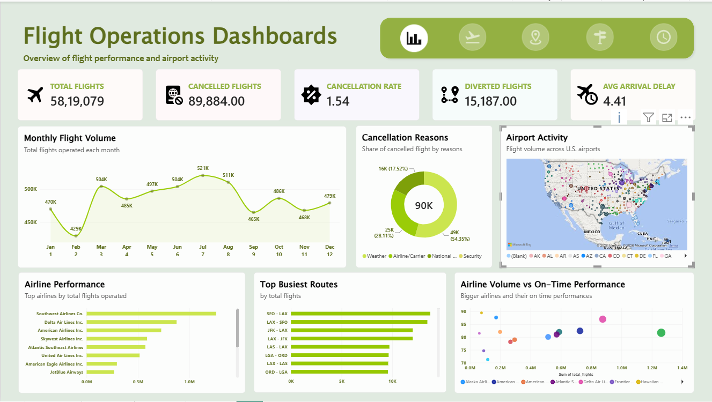
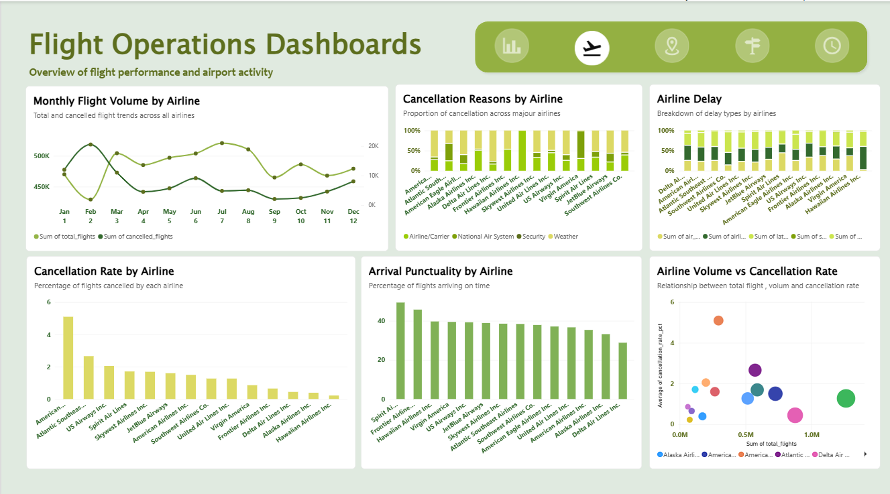
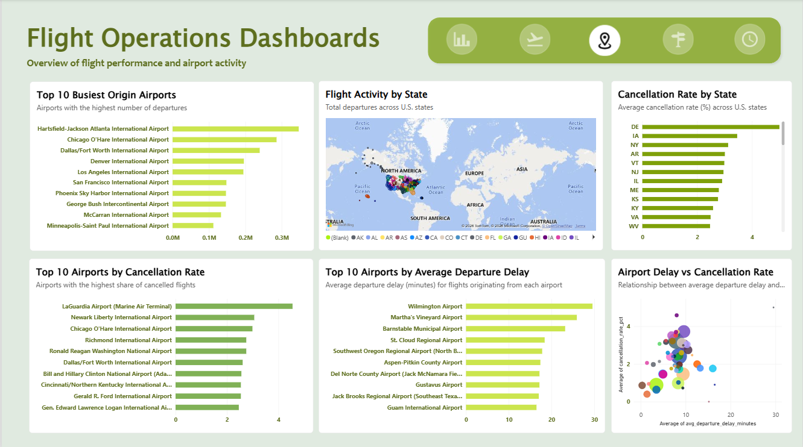
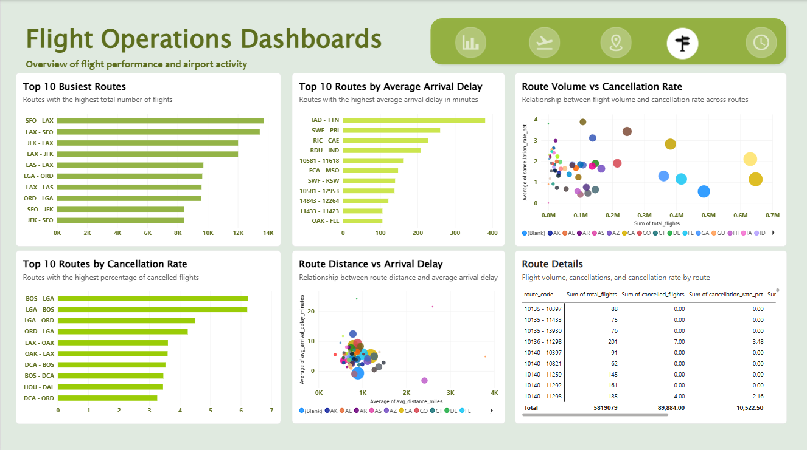
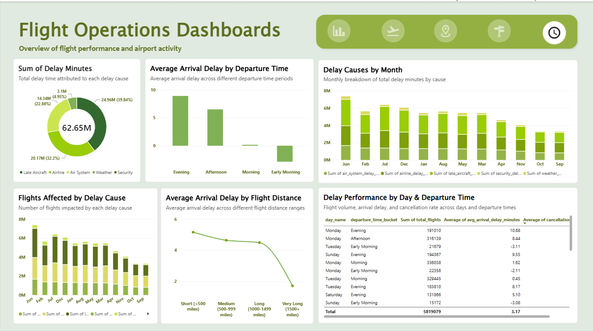

# Flight Operations Dashboard

An interactive Power BI dashboard for analysing U.S. flight operations, including flight volume, cancellations, airport activity, route performance, and delays.

## Files

- `Flight_Operations_Dashboard.pbix` — the Power BI dashboard.
- `RUN_ALL_POWERBI_VIEWS.sql` — MySQL views that prepare the data used by the dashboard.

## Dataset

Source: [2015 Flight Delays and Cancellations — U.S. Department of Transportation via Kaggle](https://www.kaggle.com/datasets/usdot/flight-delays).

The raw dataset is not included because of its size. Download it from Kaggle, load the `airlines`, `airports`, and `flights` tables into MySQL, then run `RUN_ALL_POWERBI_VIEWS.sql` before refreshing the Power BI report.

## Dashboard previews

### Overview

### Airline performance

### Airport analysis

### Route analysis

### Delay analysis

